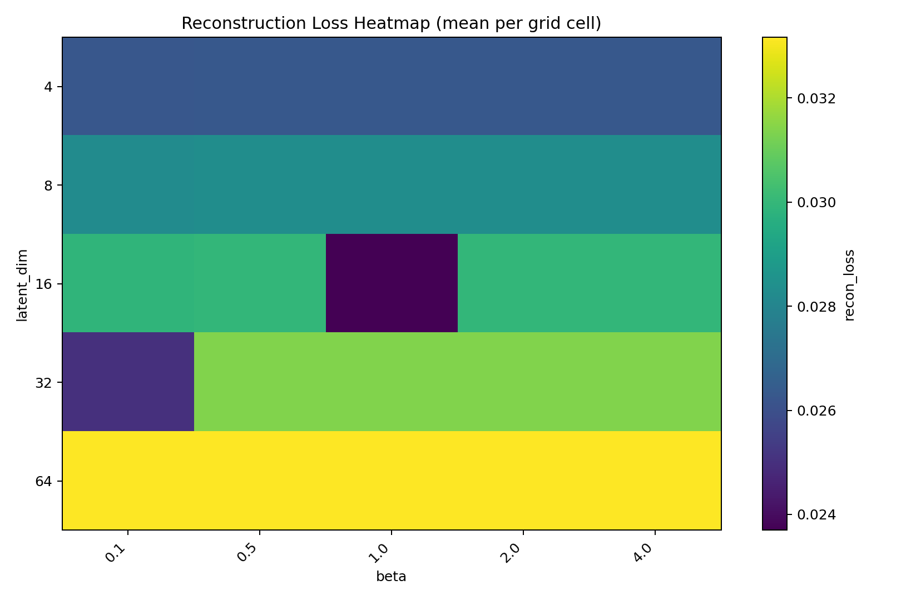
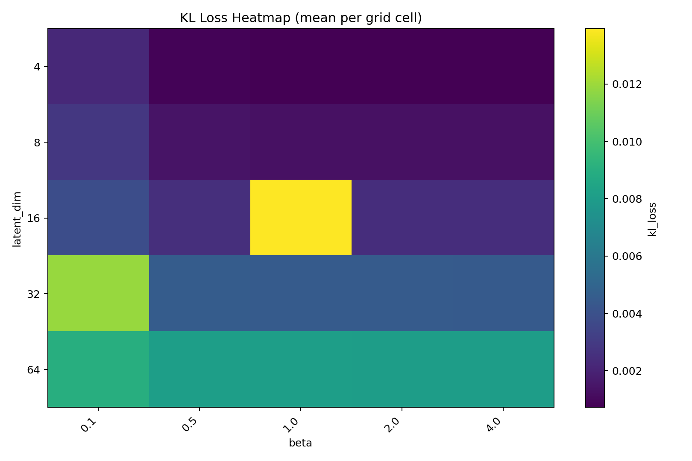
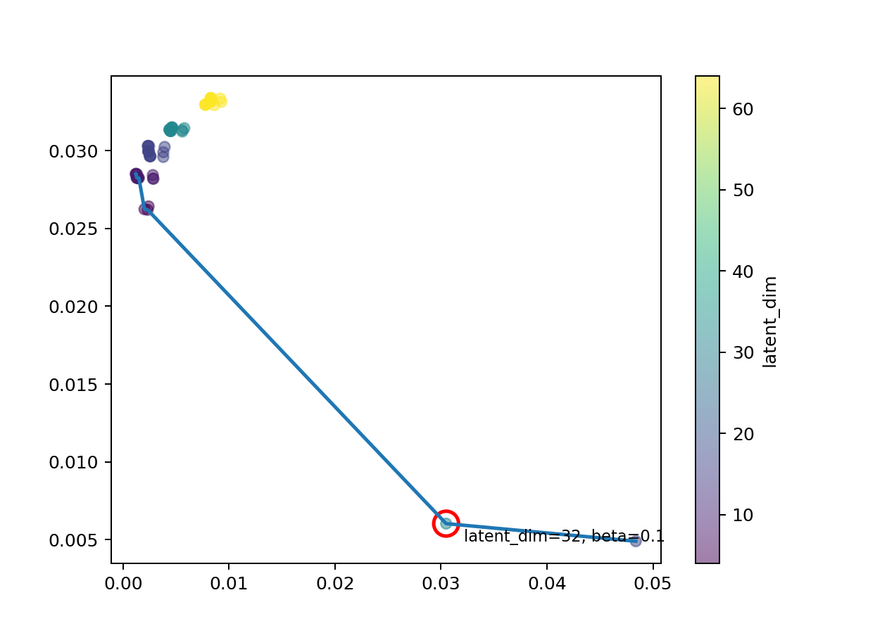

# Phase 1 — Pareto Analysis of Latent Trade-offs

---

## Objective

Study how latent dimensionality and KL regularisation (`β`) influence the reconstruction–compression trade-off in a Text VAE.

---

## Reasoning & Hypotheses

A low reconstruction loss alone can hide posterior collapse. To select a robust configuration for later phases, we evaluate both:

- reconstruction quality
- latent information usage (KL divergence)

Hypotheses:

- increasing latent dimensionality improves reconstruction capacity
- increasing `β` strengthens regularisation and can reduce latent usage if too strong
- the best configurations lie on a Pareto frontier rather than at a single metric extreme

---

## Experimental Setup

### Model

- Encoder: `sentence-transformers/all-MiniLM-L6-v2`
- Transformer frozen (no fine-tuning)
- VAE applied to embedding space
- Gaussian latent distribution
- Training objective:

```text
Loss = Reconstruction Loss + β × KL Divergence
```

### Grid

- `latent_dim ∈ {4, 8, 16, 32, 64}`
- `β ∈ {0.1, 0.5, 1.0, 2.0, 4.0}`

### Dataset

- AG News (subset for controlled experimentation)

### Method

1. Train multiple VAE configurations.
2. Log reconstruction and KL loss.
3. Build a Pareto front.
4. Remove collapsed solutions (near-zero KL).
5. Select the Pareto knee as the trade-off sweet spot.

---

## Training

Run the sweep:

```bash
for z in 4 8 16 32 64; do
  for b in 0.1 0.5 1.0 2.0 4.0; do
    for s in 0 1 2; do
      uv run python scripts/train.py \
        --latent_dim $z \
        --beta $b \
        --seed $s \
        --max_epochs 5 \
        --limit_train 1000 \
        --limit_val 500 \
        --freeze_transformer
    done
  done
done
```

This sweep:

- loads AG News
- encodes sentences using a frozen transformer
- trains the embedding-space VAE
- logs reconstruction, KL, and total loss
- writes checkpoints and run metrics

---

## Evaluation

Run Pareto analysis:

```bash
uv run python scripts/eval.py --kl_min 0.001
```

This performs:

- metric aggregation
- collapse filtering
- Pareto front construction
- sweet-spot selection
- visualisation output

---

## Results

### Reconstruction Loss Heatmap


*Figure: Mean reconstruction loss across the grid of latent dimensions and β values.*

- Reconstruction varies more with latent dimensionality than with `β`.
- Across the β values explored, reconstruction remains relatively stable, indicating that reconstruction quality is largely insensitive to β in this range.
- Overall, the grid suggests that reconstruction is primarily controlled by latent compression (latent_dim) rather than the KL regularisation strength.

### KL Divergence Heatmap


*Figure: Mean KL divergence across the same hyperparameter grid.*

- KL divergence increases monotonically with **latent dimensionality**, reflecting the larger representational capacity of higher-dimensional latent spaces.
- Lower β values (e.g., **β = 0.1**) produce slightly weaker regularisation, while larger β values impose stronger constraints on the latent distribution.
- Together with the reconstruction heatmap, this indicates that **β mainly influences latent regularisation**, while reconstruction quality remains relatively stable.

### Pareto Frontier


*Figure: Pareto frontier showing the trade-off between reconstruction loss and KL divergence.*

- Non-dominated solutions define the reconstruction–regularisation frontier.
- Near-zero KL runs are filtered as collapsed solutions.
- The knee point is selected as the Phase 2 candidate configuration.
- KL divergence values are small in magnitude (≈10⁻⁴–10⁻²), which compresses the left region of the Pareto plot under linear scaling. This reflects typical behaviour in β-VAE training where many configurations approach KL collapse.

### Selected Sweet Spot Artifacts

- `artifacts/sweet_spot.json`
- `artifacts/pareto_front.csv`

---

## Key Findings

- Reconstruction-only model selection is insufficient for VAEs.
- KL filtering is required to detect and remove posterior collapse.
- Moderate latent sizes tend to dominate extreme settings on the frontier.

---

## Limitations and Next Steps

- Automated hyperparameter tuning is intentionally out of scope for this phase.
- Phase 2 validates whether the selected latent space supports meaningful interpolation geometry.
