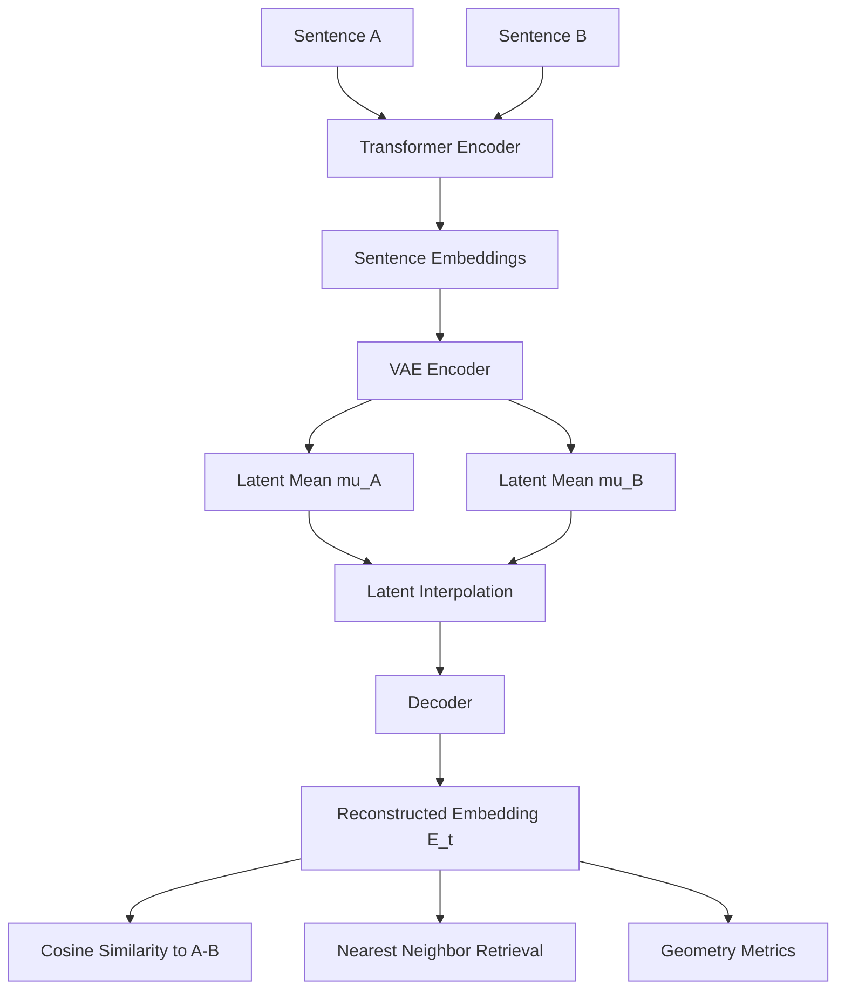

# Phase 2 — Latent Interpolation Analysis

---

## Objective

Evaluate whether the trained TextEmbeddingVAE latent space forms a meaningful geometric structure.

Core question:

> Does linear interpolation in latent space produce smooth, interpretable trajectories in embedding space?

---

## Reasoning & Hypotheses

If the latent space is structured, interpolation between two latent endpoints should produce:

- smooth cosine similarity transitions
- continuous movement through embedding space
- gradual nearest-neighbour changes rather than abrupt jumps

Posterior collapse would make these trajectories degenerate or uninformative, so collapse mitigation is required before interpolation analysis.

---

## Experimental Setup

### Model and Training Stability

The interpolation study uses the VAE setup selected from Phase 1.

To stabilise latent usage during training:

- **β warm-up** is applied so regularisation ramps up gradually
- **free bits** (`--kl_free_bits`) are used to discourage near-zero KL per latent dimension

These mechanisms reduce collapse risk and preserve informative latent structure for geometric analysis.

### Dataset

Experiments use the **STS-B (Semantic Textual Similarity Benchmark)** dataset.

Two components are used:

| Role | Split |
|-----|------|
| interpolation sentence pairs | `dev` |
| retrieval corpus | `train` |

A corpus of approximately **2000 unique sentences** is built from the training split and embedded using the frozen transformer encoder.

### Method
- Interpolation evaluation uses sentence-pair style analysis (STS-B style semantic comparison).


#### Latent Interpolation

Given two sentences:

```
A → latent vector μ_A
B → latent vector μ_B
```

Interpolation is defined as:

```
μ_t = (1 - t) μ_A + t μ_B
```

for

```
t ∈ [0,1]
```

At each step:

1. Latent vectors are interpolated  
2. The decoder reconstructs an embedding  
3. Cosine similarity to both endpoints is computed

Pipeline overview:




#### Evaluation Metrics

- Cosine Similarity Curves

For each interpolation point:

```
cos(E(t), emb_A)
cos(E(t), emb_B)
```

Expected behaviour:

- similarity to A decreases
- similarity to B increases

Smooth curves indicate coherent latent structure.

- Path Length

Measures total movement of the decoded path:

```
Σ ||E[i+1] − E[i]||
```

Compared with a baseline:

```
linear interpolation between embeddings
```

- Curvature

Approximates how much the trajectory bends:

```
||E[i+1] − 2E[i] + E[i−1]||
```

Higher curvature suggests the embedding manifold is nonlinear.

- Geometry Ratios

Latent interpolation is compared with embedding interpolation:

```
path_ratio = path_len_lat / path_len_emb
curv_ratio = curv_lat / curv_emb
```

Large ratios indicate the decoder maps latent straight lines into **curved embedding trajectories**.

- Semantic Storyline

To interpret interpolation behaviour, reconstructed embeddings are decoded using **nearest-neighbor retrieval** from the corpus.

Snapshots are taken at:

```
t = 0      (start)
t = 0.5    (middle)
t = 1      (end)
```

The nearest sentences provide a **semantic storyline** showing how the embedding region changes along the interpolation path.


---

## Training

Example training command:

```bash
uv run python scripts/train.py \
  --latent_dim 32 \
  --beta 0.1 \
  --beta_warmup_epochs 5 \
  --num_workers 0 \
  --kl_free_bits 0.1 \
  --max_length 128
```

---

## Evaluation

Run interpolation analysis on a chosen run:

```bash
uv run python scripts/interp.py \
  --min_len 10 \
  --run_dir runs/ld32_b0.1_s42_20260311_001705 \
  --sim_min 0.0 \
  --sim_max 1.5 \
  --num_pairs 3 \
  --corpus_size 2000 \
  --topk 5 \
  --beta 0.1
```


---

## Results

### Cosine Similarity Along Interpolation Path

The cosine similarity between decoded embeddings and the two endpoint sentences was tracked across the latent interpolation path.

Example results are shown below.


Observations:

- Cosine similarity fluctuates along the path rather than changing monotonically.
- Decoded embeddings remain within a relatively narrow similarity band with respect to the endpoints.
- The interpolation does not collapse to identical embeddings or trivial solutions.

These patterns suggest that the decoder introduces **non-linear structure in embedding space**, causing latent interpolation to follow curved trajectories rather than straight semantic transitions.


### Latent Path Geometry

Geometry metrics confirm that the decoded interpolation trajectory differs from straight interpolation in embedding space.


In particular:

- **Path length in latent decoding is significantly longer** than direct embedding interpolation.
- **Curvature values are non-zero**, indicating that the decoded path bends through embedding space. 
- Despite this curvature, decoded embeddings remain stable and do not collapse.

This behaviour is consistent with a VAE decoder mapping that reshapes latent space into a structured manifold over sentence embeddings.

Note: Because linear interpolation in embedding space is nearly straight, the baseline curvature values are close to zero. As a result, raw curvature ratios can become very large. To avoid unstable ratios caused by near-zero denominators, capped ratios are reported in the summary statistics.


### Qualitative Neighbourhood Shift

Nearest-neighbour retrieval along the interpolation path illustrates how the decoded embeddings move through embedding space. Note: The midpoint is chosen as the interpolation step where similarity to both endpoints is most balanced. If this criterion selects an endpoint, the midpoint defaults to the central interpolation step to ensure distinct START–MIDDLE–END snapshots.

Example (one pair):

Pair 3 | STS similarity = 0.00

--- Semantic storyline ---
mid_idx = 2, t = 0.20

START (t=0.00)
01 | 0.843 | A baseball player throws the ball.
02 | 0.843 | A woman is eating a cupcake.
03 | 0.843 | A man is taking pictures of ant.
04 | 0.843 | A girl is eating a cupcake.
05 | 0.843 | A man rides off on a motorcycle.

MIDDLE (t=0.20)
01 | 0.822 | The man is singing and playing the guitar.
02 | 0.821 | The man is talking on the phone.
03 | 0.821 | A young boy sings and plays a guitar.
04 | 0.821 | The man sang on stage into the microphone.
05 | 0.821 | A white cat stands on the floor.

END (t=1.00)
01 | 0.845 | A young boy sings and plays a guitar.
02 | 0.845 | The girl applied face makeup to a man.
03 | 0.844 | A boy is singing and playing the piano.
04 | 0.844 | A white and brown dog runs in a field.
05 | 0.844 | The white and brown dog runs across the grass.


Observation:

The nearest-neighbour sentences shift between different activity-based semantic neighbourhoods along the interpolation path.

The START position retrieves simple single-actor actions (e.g. eating, throwing, riding), while the intermediate region retrieves performance or communication-related activities (e.g. singing, speaking).

Although the interpolation does not produce a strict semantic progression toward the second endpoint, the retrieved neighbours indicate that the decoded embeddings move through distinct regions of the sentence embedding space.


---

## Key Findings

- The learned latent space supports coherent interpolation behaviour.
- Collapse mitigation (β warm-up + free bits) is important for stable geometry.

---

## Limitations and Next Steps

- Although latent interpolation produces stable trajectories in embedding space, the decoded intermediate points do not always form clear semantic transitions between the endpoint sentences. Nearest-neighbour retrieval indicates movement between embedding neighbourhoods, but the progression is not consistently interpretable. Further work is needed to improve the alignment between latent interpolation paths and semantic structure.
- Additional sweeps over `β` and `latent_dim` can map how geometry changes with regularisation and capacity.
