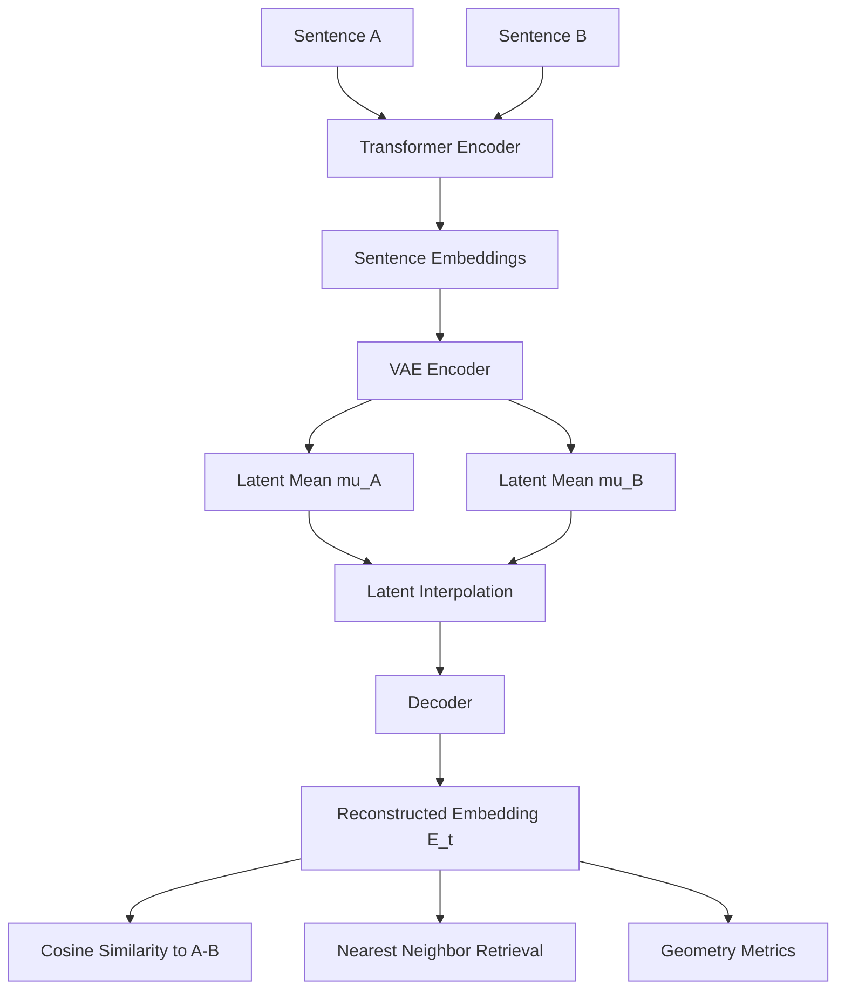

# Phase 2 — Latent Interpolation Analysis

## Objective

This phase evaluates whether the **TextEmbeddingVAE latent space** forms a meaningful geometric structure.

The central question is:

> Does linear interpolation in latent space produce smooth trajectories in embedding space?

If the latent space is well-structured, interpolation should show:

- smooth cosine similarity transitions  
- continuous movement in embedding space  
- gradual shifts in nearest-neighbour sentences  

---

# Latent Interpolation Pipeline



---

# Dataset

Experiments use the **STS-B (Semantic Textual Similarity Benchmark)** dataset.

Two components are used:

| Role | Split |
|-----|------|
| interpolation sentence pairs | `dev` |
| retrieval corpus | `train` |

A corpus of approximately **2000 unique sentences** is built from the training split and embedded using the frozen transformer encoder.

This corpus allows decoding latent points into **human-readable nearest neighbours**.

---

# Latent Interpolation

Given two sentences:

```
A → latent vector μ_A
B → latent vector μ_B
```

Interpolation is defined as:

```
μ_t = (1 - t) μ_A + t μ_B
```

for

```
t ∈ [0,1]
```

At each step:

1. Latent vectors are interpolated  
2. The decoder reconstructs an embedding  
3. Cosine similarity to both endpoints is computed  

---

# Evaluation Metrics

## Cosine Similarity Curves

For each interpolation point:

```
cos(E(t), emb_A)
cos(E(t), emb_B)
```

Expected behaviour:

- similarity to A decreases
- similarity to B increases

Smooth curves indicate coherent latent structure.

---

## Path Length

Measures total movement of the decoded path:

```
Σ ||E[i+1] − E[i]||
```

Compared with a baseline:

```
linear interpolation between embeddings
```

---

## Curvature

Approximates how much the trajectory bends:

```
||E[i+1] − 2E[i] + E[i−1]||
```

Higher curvature suggests the embedding manifold is nonlinear.

---

## Geometry Ratios

Latent interpolation is compared with embedding interpolation:

```
path_ratio = path_len_lat / path_len_emb
curv_ratio = curv_lat / curv_emb
```

Large ratios indicate the decoder maps latent straight lines into **curved embedding trajectories**.

---

# Semantic Storyline

To interpret interpolation behaviour, reconstructed embeddings are decoded using **nearest-neighbor retrieval** from the corpus.

Snapshots are taken at:

```
t = 0      (start)
t = 0.5    (middle)
t = 1      (end)
```

The nearest sentences provide a **semantic storyline** showing how the embedding region changes along the interpolation path.

---
# Intermediate observations

Dataset suitability
Initial experiments used sentence pairs from AG News. However, these pairs did not provide sufficient semantic separation for interpolation experiments, as many sentences within the dataset are topically similar.
To obtain clearer semantic variation between sentence pairs, the STS-B (Semantic Textual Similarity Benchmark) dataset was adopted instead.
Posterior collapse with Phase 1 configuration
When training was run using the Phase 1 “sweet spot” hyperparameter configuration, the VAE experienced posterior collapse, with the KL divergence rapidly approaching 0. This indicated that the model was ignoring the latent variables and relying solely on the decoder.
Beta warm-up strategy
To mitigate this, a β warm-up schedule over the first 5 epochs was introduced.
Under this approach, the KL weight (β) is gradually increased during early training, allowing the latent space to expand before strong regularisation is applied.
Free-bits strategy
Posterior collapse still occurred intermittently even with β warm-up.
To address this, a free-bits strategy was implemented, which enforces a minimum KL contribution per latent dimension. This penalises very small KL values and discourages the model from collapsing the latent representation.
This modification successfully stabilised training and prevented posterior collapse.
⸻
Why this matters
These adjustments ensure that the latent space remains informative and structured, rather than collapsing to a trivial representation. A well-formed latent space is critical for this project because the goal is to:
• interpolate between sentence embeddings in latent space
• decode meaningful intermediate embeddings
• analyse the geometric structure of semantic transitions
Without preventing posterior collapse, the interpolation experiments would produce degenerate or uninformative trajectories.


# Training the Model
Model training is performed using

```bash

uv run python scripts/train.py  --latent_dim 32 --beta 0.1 --beta_warmup_epochs 5  --num_workers 0 --kl_free_bits 0.1 --max_length 128
uv run python scripts/train.py \      
--latent_dim 32 \
--beta 0.1 \
--beta_warmup_epochs 5 \
--num_workers 0 \
--kl_free_bits 0.1 \
--max_length 128
```

# Interpolation of latent space

Interpolation of the latent space is performed by selecting the created training run directory, beta and the latent dimension

uv run python scripts/interp.py --min_len 10 \                    
--run_dir runs/ld32_b0.1_s42_20260311_001705 \
--sim_min 0.0 \
--sim_max 1.5 \
--num_pairs 3 \
--corpus_size 2000 \
--topk 5 --beta 0.1

The interpolation experiments in Phase 2 use a representative configuration from the Phase 1 sweep. In the current implementation the configuration is specified manually rather than being automatically loaded from the Pareto sweet-spot selection. The values correspond to the selected configuration identified in Phase 1.
Automating this linkage between Phase 1 model selection and Phase 2 evaluation is planned as a future improvement.
Future versions may automatically retrieve the selected configuration from Phase 1 outputs (e.g., Pareto analysis) to ensure tighter coupling between model selection and geometry evaluation.


# Key findings

Typical observations:

- cosine similarity transitions smoothly between endpoints  
- latent paths are significantly longer than embedding-linear paths  
- curvature ratios indicate nonlinear embedding trajectories  

These results suggest the latent space behaves as a **smooth coordinate system over the embedding manifold**.

---

# Future Work

Future experiments will investigate how training parameters influence latent geometry, including:

- KL regularisation strength (β)  
- latent dimensionality  

The current training framework already supports these configurations.

---

## Summary

Phase 2 demonstrates that the VAE latent space supports **smooth interpolation and structured geometry**, consistent with a learned latent manifold underlying sentence embeddings.


